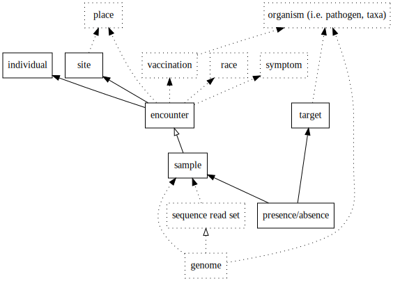

# Design notes for summer 2019

## Topics

 1. [Overview](01-overview.md)
 2. [Organisms](02-organisms.md)
 3. [Places](03-places.md)
 4. [FHIR](04-fhir.md)
 5. [RDML](05-rdml.md)
 6. [REDCap](06-redcap.md)
 7. [Genomics](07-genomics.md)
 8. [Vaccination](08a-vaccination.md), [Race and Ethnicity](08b-race-ethnicity.md), & [Symptoms](08c-symptoms.md)
 9. [Modularization](09-modularization.md)
10. [Infrastructure](10-infrastructure.md)
