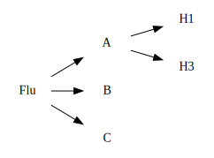

# Organisms

A table of common organisms, i.e. pathogens or other taxa, which is
hierarchical in nature.

## Motivation

1. Ask questions of the presence/absence data at more abstract levels than
   target.  For example, we test for `Flu_A_H1` and `Flu_A_H3` but have cases
   where we want to aggregate on all Flu A or all Flu.

2. A place to store details about an organism, such as if it is considered
   reportable or not, to aid with automated processes.

## Challenges

1. The data is hierarchical, but we're in a relational model.

   The standard solution is to support a single parent/child relationship which
   is walked using "recursive" (actually iterative) queries in SQL and encoded
   into a view.

2. We need to pick a taxonomy, and possibly ontology, to use for populating
   organism records.  We likely want to start with a very constrained subset of
   what's immediately useful to us, based on what's most interesting in the
   existing targets.
